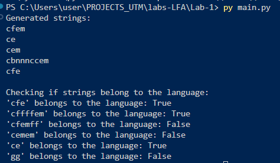

# Laboratory 1: Regular Grammars

### Course: Formal Languages & Finite Automata
### Author: Madalina Chirpicinic, FAF-233

----

## Theory
* Alphabet -- finite, nonempty set of symbols.
* String -- sequence of symbols from an alphabet.
* Language -- set of strings form an alphabet.
* Grammar -- an ordered quadruple of:
    a. VN: finite set of non-terminal symbols
    b. VT: finite set of terminal symbols
    c. S: start symbol
    d. P: finite set of productions of rules
* Automaton -- theoretical machine to model computations.
* Finite state automaton -- machine with finite amount of memory (states).
* Components: set of possible states, alphabet, transition fucntion, initial state, (accepting) final states.


## Objectives:

1. Discover what a language is and what it needs to have in order to be considered a formal one;

2. Provide the initial setup for the evolving project that you will work on during this semester. You can deal with each laboratory work as a separate task or project to demonstrate your understanding of the given themes, but you also can deal with labs as stages of making your own big solution, your own project. Do the following:

    a. Create GitHub repository to deal with storing and updating your project;

    b. Choose a programming language. Pick one that will be easiest for dealing with your tasks, you need to learn how to solve the problem itself, not everything around the problem (like setting up the project, launching it correctly and etc.);

    c. Store reports separately in a way to make verification of your work simpler (duh)

3. According to your variant number, get the grammar definition and do the following:

    a. Implement a type/class for your grammar;

    b. Add one function that would generate 5 valid strings from the language expressed by your given grammar;

    c. Implement some functionality that would convert and object of type Grammar to one of type Finite Automaton;

    d. For the Finite Automaton, please add a method that checks if an input string can be obtained via the state transition from it;


## Implementation description


1. In the Grammar class, I define the grammar rules based on **variant 6**. The class includes a constructor and two main methods responsible for generating valid strings and converting the grammar into a finite automaton.  

2. The constructor initializes the terminals, non-terminals, production rules, and the initial state S, using `set` and `dictionary` data structures. The production rules are stored as a dictionary where each non-terminal maps to a list of possible production results.  

3. The `generate_string(self)` method uses recursion and Python's `random` library to generate a valid sequence of symbols, starting from the initial state. It ensures that the generated strings conform to the production rules.  

```python
import random

class Grammar:
    def __init__(self, VN, VT, S, P):
        self.VN = VN 
        self.VT = VT 
        self.S = S  
        self.P = P  

    def generate_string(self, symbol=None):
        if symbol is None:
            symbol = self.S  
        if symbol in self.VT: 
            return symbol
        
        production = random.choice(self.P.get(symbol, []))  
        return ''.join(self.generate_string(sym) for sym in production)
    ```
4. `def to_finite_automaton(self):` transforms my grammar into a finite automaton. The class `class FiniteAutomaton:` has this purpose.
5. In the cosntructor of `class FiniteAutomaton:` I am defining the elements of my alphaebt: states (VN), alphabet (VT), transitions (PR), start state (S), end state (F). 
6. The method form_transitions uses dictionary data structure to create and store teh transitions between symbols. I iterate through all non-terminals, then through their respective rules. !!! I always assume (and also based on the input) that the first character is a terminal, and the second a non-terminal in th einput of production rules.
7. During my iteration I have 2 cases: symbol is a terminal, then its next transition is F final state. Production is terminal + non-terminal, it transitions to the non-terminal.
```
def __form_transitions(self, grammar):
        for state in grammar.VN:
            for production in grammar.P[state]:
                if len(production) == 1 and production[0] in grammar.VT:
                    # transitioning to final state 'F' for single terminal
                    self.transitions[state].setdefault(production[0], []).append('F')
                elif len(production) == 2:
                    # transitioning to another state for terminal + non-terminal
                    self.transitions[state].setdefault(production[0], []).append(production[1])
```
8. In `def string_in_language(self, input_string):` method, if I reach the final state F using BFS search, I return true, otherwise false. I store initial state in a queue and go through all possible paths of words that can be creaetd.
9. In function main I generate 5 random string using my grammar definitions and method. I then chekc 5 random inputs from my tests array and check if they exist in my language or not. And dispaly this on the screen

## Conclusions / Screenshots / Results
As a result, I have generated 5 random string using my grammar definitions and method `generate_string `. I then checked 5 random inputs from my test_strings array `test_strings = ['cfe', 'cffffem', 'cfemff', 'cemem', 'ce', 'gg']` and check if they exist in my language or not. And dispaly this on the screen



In conclusion, in this laboratory work I explained and explored the basics of regular grammars and their connection to finite automata. The main goal was to understand how formal languages are defined and how they can be processed using computational models. To achieve this, I implemented a Grammar class that generates valid strings based on a given set of production rules. Additionally, I converted the grammar into a finite automaton, which allowed me to check if certain strings belong to the defined language.
The results of the laboratory work were satisfactory, since I maanged to successfully build and implement the required tasks, obtaining a correct and valid response. Understanding these fundamental manipulations will be useful for more complex topics in formal languages and automata theory.