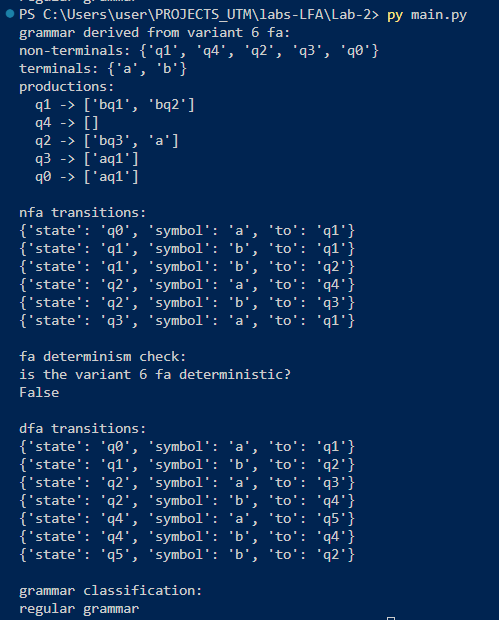
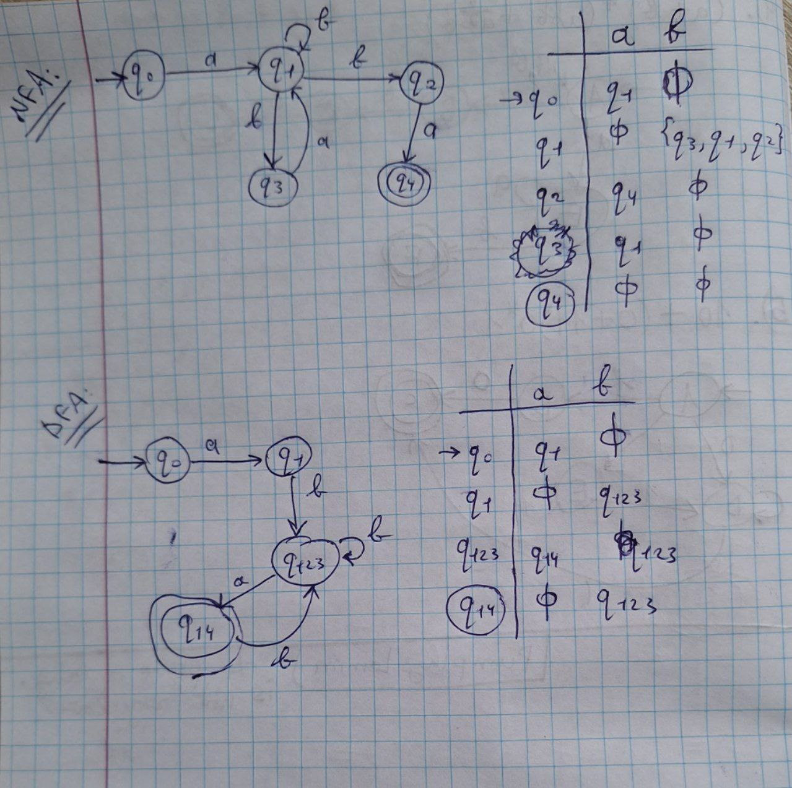

# Laboratory 2: Determinism in Finite Automata, NDFA-to-DFA Conversion, and Chomsky Hierarchy

### Course: Formal Languages & Finite Automata  
### Author: Cretu Dumitru (with kudos to Vasile Drumea and Irina Cojuhari)

---

## Theory

- **Finite Automaton (FA):**  
  A finite automaton is a computational model defined by a finite set of states, an alphabet of symbols, a transition function mapping state–symbol pairs to next states, an initial state, and one or more final (accepting) states.

- **Deterministic vs. Non-Deterministic Automata:**  
  - **Deterministic FA (DFA):** Has exactly one transition for every state and input symbol.  
  - **Non-deterministic FA (NDFA/NFA):** May have multiple transitions for a given state and input symbol, allowing multiple possible computational paths.

- **Regular Grammars & Chomsky Hierarchy:**  
  Regular grammars (Type‑3) are the simplest type in the Chomsky hierarchy. Their production rules are limited to forms such as:
  - `A → a`  
  - `A → aB`  
  where *A* and *B* are non-terminals, and *a* is a terminal.  
  In this project, we verify that the grammar derived from the FA conforms to these restrictions.

---

## Objectives

1. **Understanding Automata:**  
   Understand the fundamentals of finite automata, including determinism and non-determinism.

2. **FA-to-Regular Grammar Conversion:**  
   Convert a given finite automaton into a corresponding regular grammar by mapping transitions to production rules.

3. **Determinism Check:**  
   Implement functionality to verify if an FA is deterministic by ensuring a unique transition for each state-symbol pair.

4. **NDFA-to-DFA Conversion:**  
   Apply the subset construction algorithm to convert a non-deterministic FA into a deterministic FA.

5. **Grammar Classification:**  
   Validate whether the derived grammar is regular (Type‑3) by ensuring that its productions adhere to the expected format.

---

## Implementation Description

### 1. Grammar Class

The `Grammar` class encapsulates a formal grammar and includes methods for checking whether the grammar is regular.

#### Constructor and Initialization

```
class Grammar:
    def __init__(self, non_terminals, terminals, productions, start_symbol):
        self.non_terminals = non_terminals
        self.terminals = terminals
        self.productions = productions
        self.start_symbol = start_symbol
```
Regular Grammar Check
This private method checks each production to ensure it follows the format of a regular grammar.

```
    # Check if the grammar is regular (type 3)
    def __check_type3(self):
        for A, prods in self.productions.items():
            # Ensure A is a non-terminal
            if A not in self.non_terminals:
                return False
            for prod in prods:
                if len(prod) == 1:
                    # Production must be a terminal if it is a single symbol
                    if prod not in self.terminals:
                        return False
                else:
                    # For productions with more than one symbol:
                    # The first symbol must be a terminal and the remainder must be a non-terminal.
                    if prod[0] not in self.terminals or prod[1:] not in self.non_terminals:
                        return False
        return True
```
Grammar Type Classification

```
    # Return "regular grammar" if valid, else "invalid grammar type"
    def return_grammar_type(self):
        if self.__check_type3():
            return "regular grammar"
        return "invalid grammar type"
```
2. FiniteAutomaton Class
The FiniteAutomaton class models an automaton, including methods for checking determinism, converting to a regular grammar, and transforming an NDFA into a DFA.

Constructor and Initialization
```
class FiniteAutomaton:
    def __init__(self, states, alphabet, initial_state, final_states, transitions):
        self.states = states
        self.alphabet = alphabet
        self.initial_state = initial_state
        self.final_states = final_states
        self.transitions = transitions  # List of dicts: {"state": , "symbol": , "to": }
```
Determinism Check
This method verifies that each (state, symbol) pair has a unique transition.

```
    # Check determinism: one transition per state-symbol pair
    def is_deterministic(self):
        seen = set()
        for t in self.transitions:
            key = (t["state"], t["symbol"])
            if key in seen:
                return False
            seen.add(key)
        return True
```

FA-to-Regular Grammar Conversion
First, production rules are generated from transitions.

```
    # Generate productions for FA -> regular grammar conversion
    def __get_productions(self):
        productions = {state: [] for state in self.states}
        for t in self.transitions:
            if t["to"] in self.final_states:
                productions[t["state"]].append(t["symbol"])
            else:
                productions[t["state"]].append(t["symbol"] + t["to"])
        return productions
```
Then, the FA is converted into a grammar.

```
    # Convert FA to regular grammar
    def convert_to_grammar(self):
        prods = self.__get_productions()
        return Grammar(self.states, self.alphabet, prods, self.initial_state)
```
NDFA-to-DFA Conversion
This method uses the subset construction algorithm to convert an NDFA into a DFA.

```
    def move(states, symbol):
            result = set()
            for t in self.transitions:
                if t["state"] in states and t["symbol"] == symbol:
                    result.add(t["to"])
            return result
```


3. Variant 6 FA Definition
This function defines a specific automaton (variant 6) to demonstrate non-determinism and the conversion process.

```
def variant6_fa():
    states = {"q0", "q1", "q2", "q3", "q4"}
    alphabet = {"a", "b"}
    initial_state = "q0"
    final_states = {"q4"}
    transitions = [
        {"state": "q0", "symbol": "a", "to": "q1"},
        {"state": "q1", "symbol": "b", "to": "q1"},
        {"state": "q1", "symbol": "b", "to": "q2"},
        {"state": "q2", "symbol": "b", "to": "q3"},
        {"state": "q3", "symbol": "a", "to": "q1"},
        {"state": "q2", "symbol": "a", "to": "q4"},
    ]
    return FiniteAutomaton(states, alphabet, initial_state, final_states, transitions)
```

4. Main Program Flow
The main() function ties together the various components: deriving the grammar, displaying transitions, checking determinism, converting NDFA to DFA, and classifying the grammar.

```
def main():
    fa = variant6_fa()

    # Derive and display regular grammar from variant 6 FA
    rg = fa.convert_to_grammar()
    print("grammar derived from variant 6 fa:")
    print("non-terminals:", rg.non_terminals)
    print("terminals:", rg.terminals)
    print("productions:")
    for nt in rg.productions:
        print(f"  {nt} -> {rg.productions[nt]}")

    # Display original NDFA transitions
    print("\nnfa transitions:")
    for t in sorted(fa.transitions, key=lambda x: (x["state"], x["symbol"])):
        print(t)

    # Check if the FA is deterministic
    print("\nfa determinism check:")
    print("is the variant 6 fa deterministic?")
    print(fa.is_deterministic())

    # Convert NDFA to DFA and display transitions
    dfa = fa.convert_to_dfa()
    print("\ndfa transitions:")
    for t in sorted(dfa.transitions, key=lambda x: (x["state"], x["symbol"])):
        print(t)

    # Classify the derived grammar
    print("\ngrammar classification:")
    print(rg.return_grammar_type())

```

The outputs of the problem are as follows:
<br>

<br>
The screenshot depicts the output of the problem. Firstly the derived grammmar from the automata provided in variant 6 of the lab. The NFA transitions are depicted as well as the check for determistism that says that the FA is not deterministic. Then the conversion of NFA to DFA is displayed and in the end the grammar classification is assessed as regular gramamr (type 3).

<br>
The results of the problem can be verified by checking the graphical representation of the NFA, buidling the transitions table, converting it to DFA, and visually representing in on paper. We observe that the results match, therefore the implementation of the laboratory work program is correct and complete:


## Conclusions
This laboratory work at Languages and Formal Automata explores the concept of finite automata and determinism by examining how non-deterministic behavior can be identified and resolved. The implementation verifies that each state-symbol pair has a unique transition using the is_deterministic() method. The lab then applies the subset construction algorithm to transform a non-deterministic finite automaton into a deterministic one, simplifying further analysis and implementation. In addition, the automaton is converted into a regular grammar by generating production rules through the __get_productions() method. The resulting grammar is subsequently verified as Type‑3 using the return_grammar_type() method. This structured approach illustrates the practical application of theoretical concepts in formal languages and automata theory. Overall, the lab provides a clear demonstration of how these concepts can be implemented in real-world scenarios.