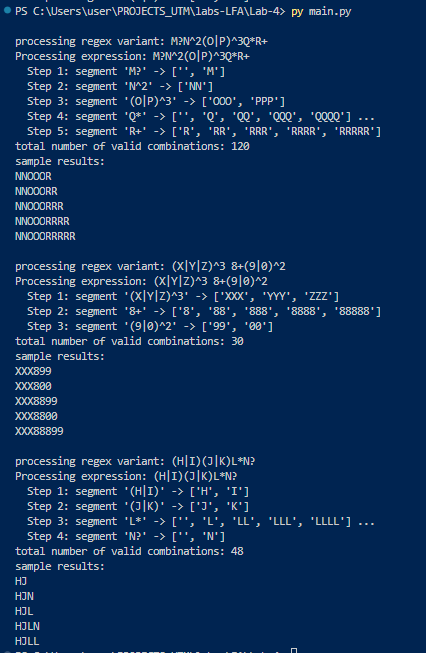

# Regex Expansion Program

### Course: Formal Languages & Finite Automata
### Author: Madalina Chirpicinic, FAF-233

----


## Introduction

Regular expressions are a powerful tool used for defining search patterns in text. They are extensively utilized in tasks such as text parsing, data validation, searching, and replacing operations. This lab presents a regex expansion tool that processes simplified regex-like expressions and generates all possible valid strings based on the input pattern.

## Theory
Regular expressions provide a concise and flexible means to “match” (or find) strings of text, such as particular characters, words, or patterns of characters. They are used for tasks ranging from simple searches within documents to sophisticated text processing in programming. In this project, a custom syntax is implemented to support a subset of regex functionality, allowing for literal characters, groups of alternatives, and suffix operators like optional (?), repetition (* and +), and exact repetition (^n). This approach not only aids in understanding regex concepts but also serves as the basis for generating complex combinations based on specified patterns.


## Objectives:

* Understand the mechanics behind regular expression expansion.
* Develop a tool that segments and parses regex-like expressions.
* Implement operators for optional occurrence, variable repetition, and fixed repetition.
* Combine the parsed segments using Cartesian products to generate all valid combinations.


## Implementation description

The implementation is built around several core functions, each addressing a specific aspect of regex expansion:

1. split_expansion
This function processes the input expression and splits it into segments. A segment represents either a single literal or a group of alternatives enclosed in parentheses, possibly followed by a suffix operator. It ignores whitespace and verifies that parentheses are properly matched.

This snippet scans through the expression character by character. It handles groups (like (A|B)) and literal symbols, attaching any suffix operator (optional, repeated, or exact count) immediately following the segment.

```
def split_expression(expr):
    segments = []
    i, n = 0, len(expr)
    while i < n:
        if expr[i].isspace():
            i += 1
            continue
        if expr[i] == '(':
            start = i
            i += 1
            while i < n and expr[i] != ')':
                i += 1
            if i >= n:
                raise ValueError("Unmatched parenthesis")
            group = expr[start:i+1]
            i += 1
            # Capture suffix operator if present
            suffix = ''
            if i < n and expr[i] in '?*+':
                suffix = expr[i]
                i += 1
            elif i < n and expr[i] == '^':
                suffix = '^'
                i += 1
                digits = ''
                while i < n and expr[i].isdigit():
                    digits += expr[i]
                    i += 1
                suffix += digits
            segments.append(group + suffix)
        else:
            # Process single literal characters
            seg = expr[i]
            i += 1
            suffix = ''
            if i < n and expr[i] in '?*+':
                suffix = expr[i]
                i += 1
            elif i < n and expr[i] == '^':
                suffix = '^'
                i += 1
                digits = ''
                while i < n and expr[i].isdigit():
                    digits += expr[i]
                    i += 1
                suffix += digits
            segments.append(seg + suffix)
    return segments
```

2. Parsing a Segment with Its Suffix Operator
The following function processes each segment by expanding it into its possible outputs based on its suffix. For example, (O|P)^3 will be expanded to only OOO or PPP.
```
def parse_segment(segment):
    MAX_REPEAT = 5
    def repeat_symbol(symbols, min_times, max_times):
        results = []
        for times in range(min_times, max_times + 1):
            for combo in itertools.product(symbols, repeat=times):
                results.append(''.join(combo))
        return results

    if segment.startswith('('):
        close_idx = segment.find(')')
        base_symbols = segment[1:close_idx].split('|')
        suffix = segment[close_idx+1:]
    else:
        base_symbols = [segment[0]]
        suffix = segment[1:]

    if suffix == '':
        return base_symbols
    elif suffix == '?':
        return [''] + base_symbols
    elif suffix == '*':
        return repeat_symbol(base_symbols, 0, MAX_REPEAT)
    elif suffix == '+':
        return repeat_symbol(base_symbols, 1, MAX_REPEAT)
    elif suffix.startswith('^'):
        n = int(suffix[1:])  # Fixed repetition count
        return [s * n for s in base_symbols]
    else:
        raise ValueError("Unrecognized segment suffix: " + suffix)

```

3. Expanding the Full Expression
To generate the final list of valid combinations from the complete expression, the tool computes the Cartesian product of the possible outputs from each segment.
```def expand_expression(expr):
    segments = split_expression(expr)
    expansions_per_segment = [parse_segment(seg) for seg in segments]
    return [''.join(combo) for combo in itertools.product(*expansions_per_segment)]

```
Each segment is expanded independently. The Cartesian product is then used to join one possibility from each segment, forming complete strings that represent all valid combinations based on the original expression.


4. Processing and Displaying the Expansion Steps
This helper function prints a step-by-step overview of how the expression is processed. It shows a short preview of possible outputs for each segment.
```
def process_sequence(expr):
    segments = split_expression(expr)
    print("Processing expression:", expr)
    for idx, seg in enumerate(segments, start=1):
        possible_outputs = parse_segment(seg)
        preview = possible_outputs[:5]
        preview_str = f"{preview}{' ...' if len(possible_outputs) > 5 else ''}"
        print(f"  Step {idx}: segment '{seg}' -> {preview_str}")
```
By detailing intermediate results, this function helps in debugging and understanding the transformation at each step—providing insights into both the segmentation and the expansion processes.


5. Main Routine for Execution
Finally, the main routine iterates through a list of regex variants, processes each one, and prints out the total number of valid combinations along with sample outputs.
```
if __name__ == '__main__':
    regex_variants = [
        "M?N^2(O|P)^3Q*R+",
        "(X|Y|Z)^3 8+(9|0)^2",
        "(H|I)(J|K)L*N?"
    ]
    for variant_index in range(0, 3):
        chosen_regex = regex_variants[variant_index]
        print(f"\nprocessing regex variant: {chosen_regex}")
        process_sequence(chosen_regex)
        combinations = expand_expression(chosen_regex)
        print("total number of valid combinations:", len(combinations))
        print("sample results:")
        for result in combinations[:5]:
            print(result)
```

The inputs for the variant 2 are:
```
 regex_variants = [
        "M?N^2(O|P)^3Q*R+",
        "(X|Y|Z)^3 8+(9|0)^2",
        "(H|I)(J|K)L*N?"
    ]
```
the screenshot below ilustrates its respective output:
<br>



## Conclusions / Screenshots / Results
The regex expansion tool successfully expands regex-like expressions by segmenting the input, parsing each segment based on defined suffix operators, and generating all valid combinations using the Cartesian product. Special handling ensures that expressions like (O|P)^3 yield only OOO or PPP. This modular approach provides a clear foundation for understanding regex processing and can be easily extended to support additional features. The tool demonstrates both the flexibility and power of regular expressions in automated text processing and pattern generation.